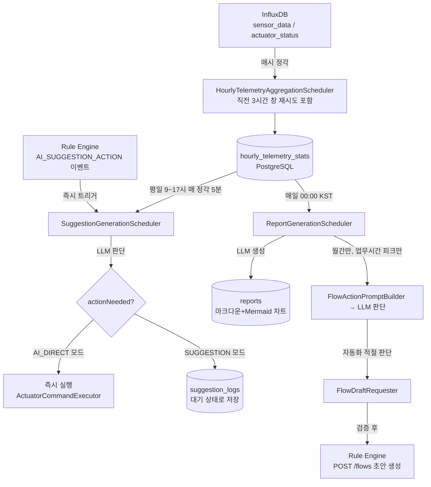
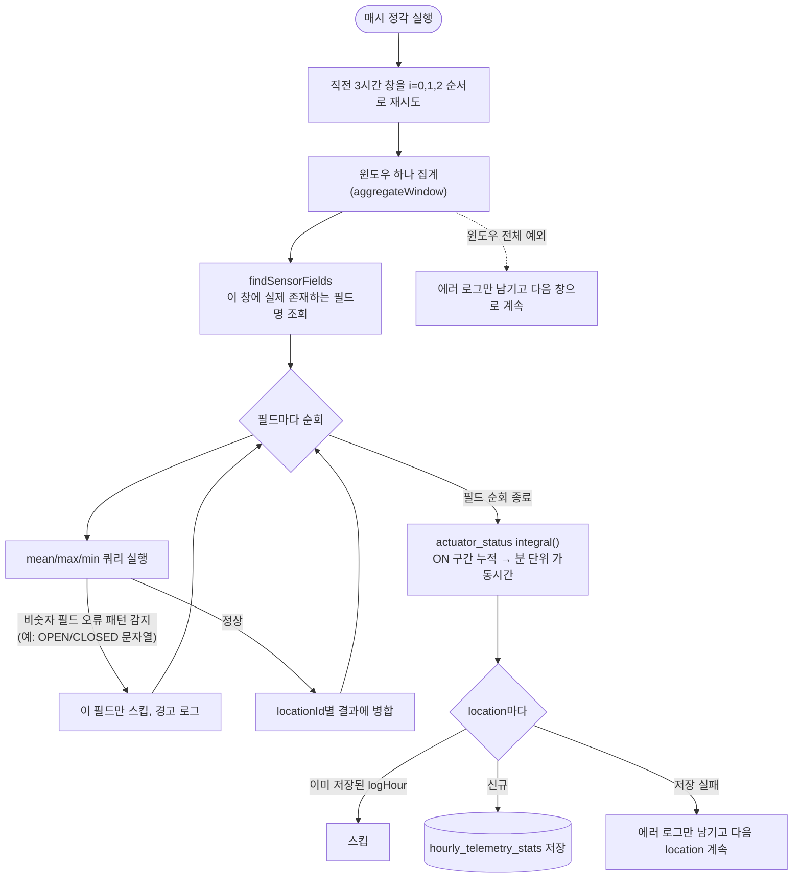
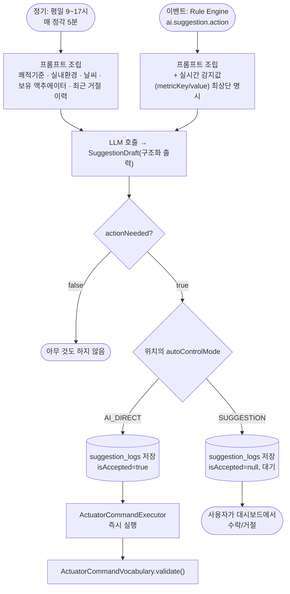
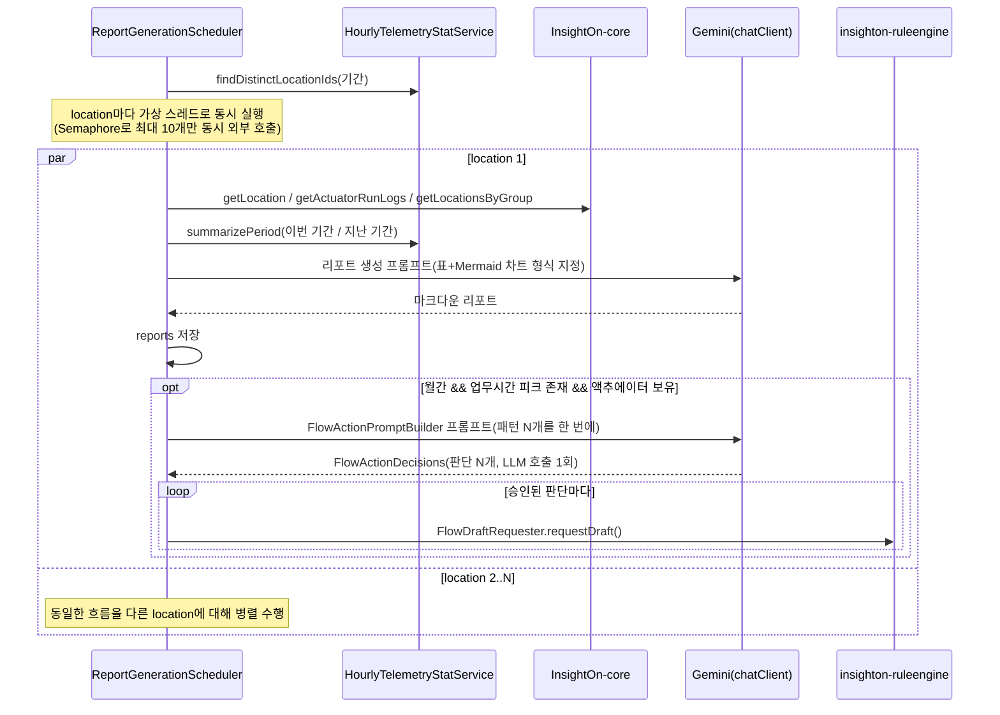
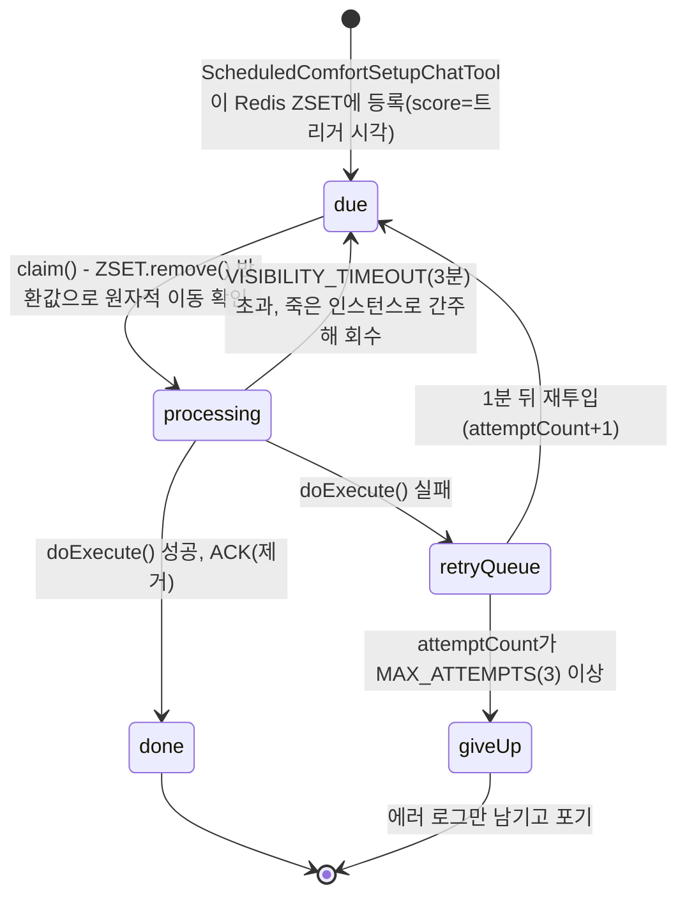
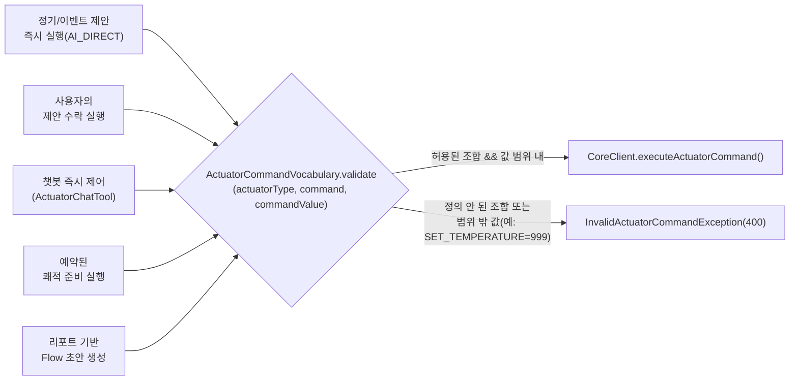
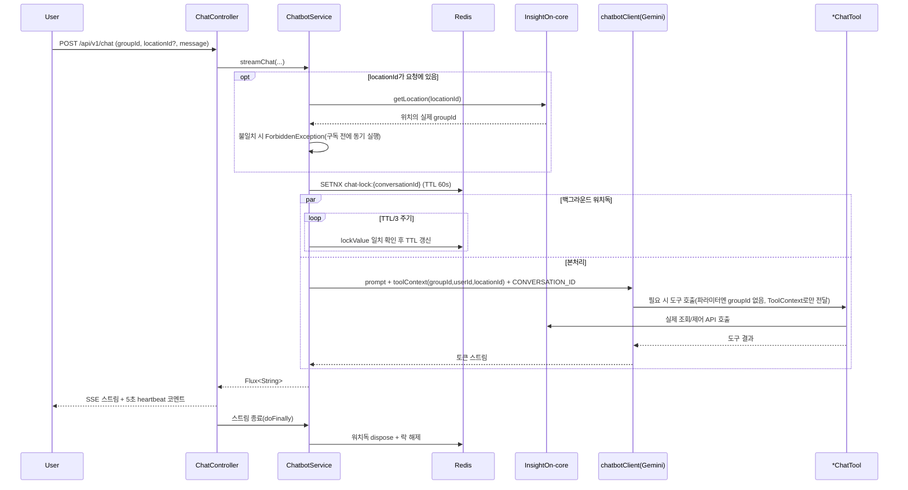
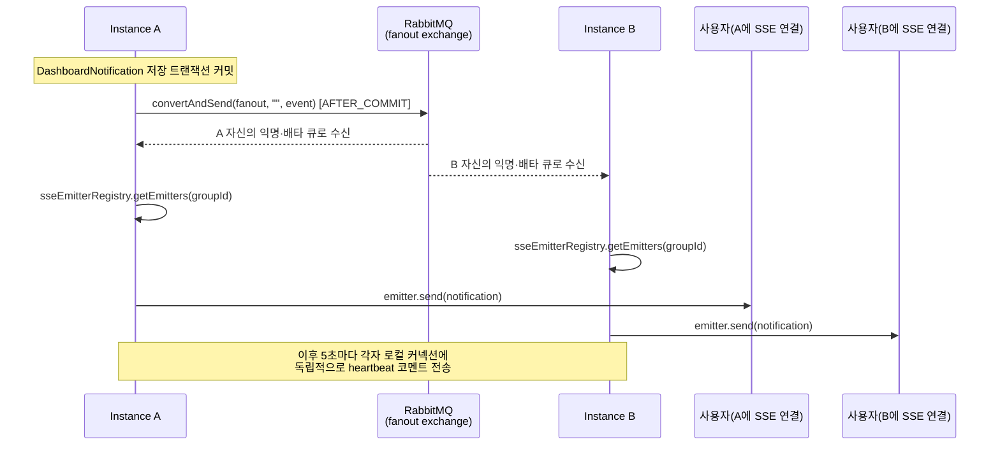
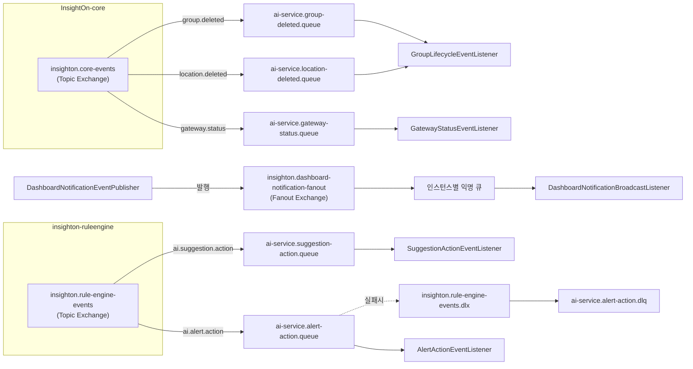

# InsightOn-ai

InsightOn 스마트오피스 IoT SaaS 플랫폼의 AI 서비스입니다. InfluxDB에 쌓인 센서/액추에이터
시계열을 시간 단위로 재집계해 **업무시간 실시간 제안**과 **주간/월간 진단 리포트**를 LLM(Gemini)으로
생성하고, 리포트가 찾아낸 반복 패턴을 근거로 **예방적 자동화(Flow) 초안**을 Rule Engine에 요청합니다.
그 위에 그룹 데이터를 도구 호출로 조회·제어하는 **챗봇**과, 다중 인스턴스 환경에서 동작하는
**대시보드 실시간 알림(SSE)** 을 제공합니다.

같은 조직의 다른 저장소:

| 저장소                                          | 역할                                      |
|----------------------------------------------|-----------------------------------------|
| `insighton-gateway`                          | API Gateway (Spring Cloud Gateway)      |
| `insighton-auth`                             | 인증/회원 서비스                               |
| `insighton-front`                            | 프론트엔드                                   |
| `InsightOn-core`                             | 그룹/위치/디바이스/MQTT 텔레메트리 수집 등 중심 도메인 서비스   |
| `insighton-ruleengine`                       | 자동 제어 규칙 엔진(Flow 실행)                    |
| `InsightOn-actuator-simulator`               | LG ThinQ / SmartThings 액추에이터 목(mock) 서버 |
| `insighton-infra`, `insighton-k8s-manifests` | 인프라/배포 매니페스트                            |

> ⚠️ 이 서비스는 **인증/인가 로직이 없습니다.** `InsightOn-core`와 동일하게, 상류 API Gateway가
> 검증 후 붙여주는 `X-User-Id` 헤더와 요청의 `groupId` 파라미터를 신뢰하는 헤더 기반 모델입니다.
> 자세한 내용은 [보안 모델](#보안-모델) 참고.

---

## 목차

- [기술 스택](#기술-스택)
- [도메인 모델](#도메인-모델)
- [배치 파이프라인](#배치-파이프라인)
- [액추에이터 명령 검증](#액추에이터-명령-검증)
- [챗봇](#챗봇)
- [실시간 알림 (SSE)](#실시간-알림-sse)
- [RabbitMQ / AMQP](#rabbitmq--amqp)
- [보안 모델](#보안-모델)
- [API 구조](#api-구조)
- [설정 (프로파일)](#설정-프로파일)
- [테스트](#테스트)

---

## 기술 스택

- **Java 21**, **Spring Boot 4.1.0**, Spring Cloud `2025.1.2`
- **Spring AI 2.0.0** (`spring-ai-starter-model-google-genai`) — Gemini(`gemini-3.5-flash`) 호출.
  `spring-ai-starter-model-ollama`도 의존성에 있으나 실제 코드에서 참조하는 곳은 없음(미사용)
- **Spring AI Tool Calling** (`@Tool`/`@ToolParam`/`ToolContext`) — 챗봇이 그룹 데이터를 조회·제어하는 핵심 메커니즘
- **ShedLock** (`shedlock-spring` + `shedlock-provider-jdbc-template`) — 여러 인스턴스가 동시에 떠도 같은 배치(리포트/제안/집계/예약 실행)가 중복 실행되지
  않도록 DB 기반 분산 락
- **Spring Cloud OpenFeign** — `InsightOn-core`(`CoreClient`), `insighton-ruleengine`(`RuleEngineClient`) 호출
- **PostgreSQL** + Spring Data JPA + QueryDSL 5.1(jakarta) —
  Report/SuggestionLog/EngineAlert/DashboardNotification/HourlyTelemetryStat 등 정적 도메인 데이터
- **InfluxDB** (`influxdb-client-java` 8.0.0) — 시간별 집계 배치가 읽는 원본 센서/액추에이터 시계열, 예약 실행 시 최근 값 조회
- **Redis** (`spring-boot-starter-data-redis`, 직접 `StringRedisTemplate` 사용, 별도 Redis 스타터 라이브러리 없이 자체 구현) — 챗봇 대화 잠금, 챗봇
  대화 이력(자체 구현 `ChatMemoryRepository`), 예약된 액추에이터 작업 큐(Sorted Set)
- **RabbitMQ** (`spring-boot-starter-amqp`) — `InsightOn-core`/`insighton-ruleengine`이 발행한 이벤트 소비(그룹/위치 삭제, 게이트웨이 상태, AI
  제안/알람 트리거) + 자체 알림을 인스턴스 간 팬아웃
- **commons-dbcp2** — prod 프로파일의 DB 커넥션 풀(설정 안 하면 Spring Boot 기본 HikariCP 사용)
- **springdoc-openapi 3.1.0** — Swagger UI, `*Api` 인터페이스로 문서 어노테이션과 컨트롤러 구현 분리(Core와 동일한 패턴)
- **Lombok**, Micrometer + Zipkin(Brave)
- 테스트: JUnit5, Mockito, `spring-rabbit-test`, H2(`@DataJpaTest`) — Testcontainers 미사용

---

## 도메인 모델

`com.insighton.ai.domain.*` 하위 주요 패키지 (엔티티가 있는 도메인만):

| 도메인              | 엔티티                                                                                                                                                  | 설명                                                                                                     |
|------------------|------------------------------------------------------------------------------------------------------------------------------------------------------|--------------------------------------------------------------------------------------------------------|
| `report`         | `Report` (`reportId`, `groupId`, `locationId`, `title`, `reportType`, `content`, `createdAt`)                                                        | 주간/월간 진단 리포트. `content`는 LLM이 생성한 마크다운(Mermaid 차트 포함) 원문                                               |
| `suggestion`     | `SuggestionLog` (`suggestionLogId`, `groupId`, `locationId`, `title`, `suggestionText`, `actionPayload`, `isAccepted`, `createdAt`)                  | AI가 판단한 조치 제안. `actionPayload`는 액추에이터 명령 JSON, `isAccepted`는 `null`(대기)/`true`(수락 또는 자동실행)/`false`(거절) |
| `enginealert`    | `EngineAlert` (`engineAlertId`, `eventId`, `groupId`, `locationId`, `flowId`, `title`, `message`, `severity`, `triggerValue`, `createdAt`)           | Rule Engine이 flow 실행 중 감지한 이상 상황 알람(`Severity`: enum)                                                  |
| `notification`   | `DashboardNotification` (`dashboardNotificationId`, `groupId`, `locationId`, `notificationType`, `sourceId`, `title`, `isRead`, `createdAt`)         | 대시보드 벨 알림(`NotificationType`: enum, 예: `GATEWAY`)                                                      |
| `telemetrystats` | `HourlyTelemetryStat` (`hourlyTelemetryStatId`, `locationId`, `logHour`, `metricsAvg`, `metricsMax`, `metricsMin`, `actuatorOnMinutes`, `createdAt`) | InfluxDB 원본을 1시간 단위로 재집계한 결과(JSONB 문자열 컬럼). 모든 진단/제안/자동화 판단의 원천 데이터                                    |
| `chatbot`        | (엔티티 없음, Redis 저장)                                                                                                                                   | 대화 이력은 DB가 아니라 Redis에 JSON으로 저장(아래 [챗봇](#챗봇) 참고)                                                       |
| `flow`           | (엔티티 없음)                                                                                                                                             | 예방적 자동화 프롬프트 조립(`FlowActionPromptBuilder`)만 담당, 실제 flow는 `insighton-ruleengine` 소유                     |
| `scheduledtask`  | (엔티티 없음, Redis 저장)                                                                                                                                   | 챗봇이 예약한 1회성 "쾌적 준비" 작업. Redis Sorted Set(`ScheduledActuatorTask.REDIS_KEY`)에 트리거 시각을 score로 저장         |

---

## 배치 파이프라인

InfluxDB 원본 → 시간별 재집계(`hourly_telemetry_stats`) → 그 재집계 결과를 기준으로 실시간 제안/진단
리포트/예방적 자동화를 만드는 4단계 배치가 이 서비스의 중심입니다. 전부 `@Scheduled` + `@SchedulerLock`
(ShedLock, DB 기반) 조합이라, 인스턴스가 여러 개 떠도 매 실행마다 딱 하나만 수행됩니다.



### 1. 시간별 텔레메트리 집계 — `HourlyTelemetryAggregationScheduler`



새 센서 지표가 추가돼도(스키마 변경 없이 InfluxDB에 필드만 새로 들어와도) 코드 수정 없이 그대로
집계 대상에 포함되는 것이 이 배치의 핵심 설계 의도입니다 — 필드 목록을 미리 하드코딩하지 않고
매 실행마다 "이번 창에 실제로 존재하는 필드"를 먼저 조회하기 때문입니다.

- `@Scheduled(cron = "0 0 * * * *")`, `SchedulerLock(lockAtMostFor=PT10M, lockAtLeastFor=PT1M)`
- 매 실행마다 **직전 3시간(`LOOKBACK_HOURS`) 창을 매번 다시 훑어** 재시도한다 — 특정 시간 창 집계가
  예외로 실패해도 다음 정각 실행이 자동으로 그 창을 다시 시도하는 구조. 이미 저장된 `(locationId, logHour)`는
  건너뛴다.
- `sensor_data`는 필드마다 개별 Flux 쿼리를 날려서, 자석 센서의 `OPEN`/`CLOSED` 같은 비숫자 필드가
  섞여 있어도 그 필드만 건너뛰고 나머지 숫자 필드는 계속 집계된다(`mean()`/`max()`/`min()`이 비숫자
  필드에서 던지는 오류 메시지 패턴으로 판별). 어떤 필드가 숫자인지 미리 알 필요가 없어 새 센서 지표가
  추가돼도 코드 변경 없이 동작한다.
- `actuator_status`는 `integral()` 연산으로 ON 구간의 누적 시간을 분 단위 가동시간으로 산출한다.
- location 하나가 실패해도 나머지 location은 계속 처리한다.

### 2. AI 제안 생성 — `SuggestionGenerationScheduler`



정기 경로와 이벤트 경로는 프롬프트 조립 방식만 다르고(이벤트 경로는 감지값을 최상단에 강조), 그
이후 LLM 판단 → 실행/대기 분기 로직(`applyDraft`)은 완전히 동일하게 공유합니다. 액추에이터가 아닌
조언(예: "창문을 여세요")은 `actions`가 아니라 `suggestionText`에만 담겨 자동 실행 대상에서
제외됩니다.

- 정기: `@Scheduled(cron = "0 5 9-17 * * MON-FRI", zone="Asia/Seoul")` — 평일 업무시간 매 정각
  5분 뒤(집계 배치가 정각에 끝난 뒤를 보장하기 위한 지연) 실행.
- 이벤트 기반: `insighton-ruleengine`이 `ai.suggestion.action` 라우팅 키로 발행하는
  `AiSuggestionActionEvent`를 받으면 정기 스케줄과 무관하게 즉시 한 번 더 판단(`generateEventTriggeredSuggestion`).
- 프롬프트에는 쾌적 기준값(`COMFORT_RANGE`), 실내 환경, 액추에이터 가동 현황, 실외 날씨(현재+1시간
  예보), **이 위치에 실제로 존재하는 액추에이터의 허용 명령만**(`ACTUATOR_COMMANDS`), 최근 자주
  거절된 조작 패턴(참고 신호)을 담는다. 실외 기온·미세먼지·강수 조건이 맞으면 자연환기(창문 개방)도
  텍스트 조언으로 제안하도록 유도한다.
- LLM 응답(`SuggestionDraft`, 구조화 출력)의 `actionNeeded`가 `false`면 아무것도 하지 않는다.
  `true`면 위치의 `autoControlMode`에 따라 분기:
    - `AI_DIRECT`: `suggestion_logs`에 즉시 `isAccepted=true`로 저장 + `ActuatorCommandExecutor`로
      Core에 즉시 실행 명령
    - `SUGGESTION`: `isAccepted=null`(대기)로 저장, 사용자가 대시보드에서 수락/거절
- 날씨 조회 실패, 거절 패턴 조회 실패는 배치 전체를 막지 않도록 각각 try-catch로 흡수하고 빈 값/null로
  진행한다.

### 3. 리포트 생성 + 예방적 자동화(Flow) 초안 — `ReportGenerationScheduler`



패턴이 여러 개(예: 온도·CO2·습도) 동시에 감지돼도 Flow 판단 LLM 호출은 위 다이어그램처럼 **location당
정확히 1회**입니다 — 패턴 목록을 한 프롬프트에 모두 나열해 구조화 출력(`FlowActionDecisions`)으로
한 번에 받고, 승인된 판단만 순회하며 Rule Engine에 개별 요청하는 방식이라 그렇습니다. 이 배치 판단
로직의 회귀는 `ReportGenerationSchedulerTest`가 "패턴 3개 → LLM 호출 1회, Flow 요청 3회"를 직접
검증합니다.

- 주간: `@Scheduled(cron = "0 0 0 * * *", zone="Asia/Seoul")` — 원래는 `"0 0 0 * * MON"`(매주
  월요일)이어야 하나, **현재 코드에 "TEST-ONLY: 매일 00:00 실행" 주석과 함께 임시로 매일 실행되도록
  바뀌어 있다.** 검증이 끝나면 반드시 원복해야 함(월간도 동일하게 `"0 0 0 1 * *"`로 원복 필요).
- **가상 스레드 병렬화**: 이번 기간에 데이터가 있는 location 전체를 `Executors.newVirtualThreadPerTaskExecutor()`로
  동시에 처리한다. location끼리 데이터를 공유하지 않는 완전 독립 작업이고 대부분의 시간을 DB/Feign/LLM
  응답 대기로 보내는 I/O 바운드 작업이라, 순차 처리 시 location 수만큼 누적되던 지연시간이 가장 느린
  location 1개 수준으로 줄어든다. 다만 Gemini API 분당 요청 제한·Feign 커넥션 풀 과부하를 막기 위해
  `Semaphore(MAX_CONCURRENT_REPORTS=10)`로 **실제 동시 외부 호출 개수만** 제한한다(스레드 자체는
  얼마든지 떠도 됨). DB 커넥션 풀 크기는 별도로 건드리지 않았다. location 하나가 실패해도 나머지는
  계속 진행.
- location 하나당(`generateOneReport`) 수집하는 컨텍스트: 이번/지난 기간 재집계, 엔진 알람 요약,
  AI 제안 요약, 액추에이터 조작 이력(설정 온도 변경 횟수/평균값, 조작 주체 비율), **같은 그룹 내 다른
  위치 대비 비교**(평균 대비 ±15% 이상 차이나는 지표/액추에이터만, 그룹에 비교 대상이 없으면 섹션
  자체 생략), 월간 리포트에서만 시간대별 피크 패턴, 이 위치의 기존 AI 자동화 목록과(있을 때만) 실외
  날씨.
- LLM에게 마크다운 리포트 생성을 요청하며, 지표 비교는 표로, 지난 기간 대비 변화는 **Mermaid
  `xychart-beta` 막대그래프**로 그리도록 형식까지 프롬프트에 예시로 명시한다.
- **자동화 관련 문구 가드**: "리포트에 자동화를 언급할 땐 'IF-THEN' 규칙 문법이나 특정 트리거 시각을
  쓰지 말라"고 명시한다 — 이 시스템이 실제로 자동 생성 가능한 자동화는 업무시간 내 반복 패턴 기반
  예방 조치뿐이라, 리포트 문장이 실제 생성 능력보다 더 정교한 자동화가 가능한 것처럼 오해를 주지
  않기 위함(리포트 서술과 실제 Flow 생성 로직이 완전히 분리돼 있어서 생긴 제약).
- **Flow 초안 요청**(`requestFlowDrafts`): 업무시간(9~17시) 내 피크 패턴만 대상으로, 이 위치에 실제
  존재하는 액추에이터 목록과 함께 LLM에게 "예방적 자동화가 적절한지, 적절하다면 어떤 명령인지"를
  다시 한번 구조화 출력(`FlowActionDecisions`)으로 판단시킨다 — 패턴이 여러 개(예: 온도·CO2·습도)
  동시에 있어도 **LLM 호출은 이 한 번뿐**이고, 판단 결과 목록을 순회하며 승인된 것만
  `FlowDraftRequester`로 개별 요청한다. 이 위치에 액추에이터가 아예 없으면 LLM 호출 자체를 건너뛴다.
- `FlowDraftRequester`는 Rule Engine에 `SCHEDULE → ACTUATOR_CONTROL` 2노드 고정 템플릿 flow 생성을
  요청하기 전, **`ActuatorCommandVocabulary.validate()`로 자기 자신도 한 번 더 검증**한다(이 경로만
  `ActuatorCommandRequest.of()`를 거치지 않고 Rule Engine 노드를 직접 조립하기 때문). 피크 시간
  15분 전에 조작하도록 cron을 계산하며, 자정을 넘는 피크(예: 0시)는 요일도 하루 앞당겨 계산한다.
  flow 이름에 지표명과 3시간 단위 시간대 슬롯을 포함시켜(`"[AI] temperature 예방 자동화 (9~12시)"`),
  같은 지표의 자동화가 성공해서 다음 분석 때 다른 시간대가 새 피크로 잡혀도 기존 자동화를 지워버리지
  않고 공존시킨다(진동 방지 — 자세한 배경은 [알려진 제약](#알려진-제약--todo) 참고).

### 4. 예약된 쾌적 준비 실행 — `ScheduledActuatorTaskExecutionScheduler`



`claim()`에서 `ZSET.remove()`의 반환값(실제로 지운 개수)을 반드시 확인해야 두 인스턴스가 같은
`due` 스냅숏을 보고 동시에 같은 작업을 집어가는 걸 막을 수 있습니다 — 예전엔 이 값을 확인하지
않아 중복 실행 가능성이 있었다고 코드 주석에 명시돼 있습니다. "먼저 지우고 나중에 처리"가 아니라
"processing으로 옮긴 뒤에 처리"하는 순서 자체가, 처리 도중 인스턴스가 죽어도 작업이 유실되지
않고 `VISIBILITY_TIMEOUT` 이후 자동 회수되게 하는 핵심입니다.

- 챗봇의 `ScheduledComfortSetupChatTool`("오늘 오후 3시에 회의 있어" 같은 요청)이 Redis Sorted
  Set(`ScheduledActuatorTask.REDIS_KEY`)에 트리거 시각을 score로 넣어두면, 이 스케줄러가
  `@Scheduled(fixedRate=60_000)`으로 매분 폴링해 시각이 된 작업만 꺼내 실행한다.
- **at-least-once + 멱등 소비 패턴**: `due`(원본) → `processing`(진행 중, `VISIBILITY_TIMEOUT=3분`
  유효시간 포함) 순서로 **원자적 이동**(`ZSET.remove()`의 반환값으로 실제 제거 성공 여부 확인) 후
  처리하고, 성공하면 `processing`에서 제거(ACK)한다. `remove()`의 반환값을 반드시 확인해야
  두 인스턴스가 같은 작업을 동시에 집어가는 걸 막을 수 있다는 점이 코드 주석에 명시돼 있다.
  `processing`에 유효시간이 지나도 남아있는 작업은(처리 인스턴스가 죽은 것으로 간주) 다음 실행 때
  `due`로 되돌린다(`reclaimTimedOutTasks`).
  실행 실패 시 `MAX_ATTEMPTS=3`까지 1분 뒤 재시도, 초과하면 포기.
- 실행 시점엔 직전 확정 시간 집계 + InfluxDB에서 최근 10분 평균(`LIVE_WINDOW_MINUTES`)을 함께
  조회해 LLM에게 조치 필요 여부를 판단시키고, Rule Engine 승인 절차 없이 바로 실행한다(채팅으로
  직접 요청한 1회성 예약이라 요청 자체가 승인이라는 설계).

---

## 액추에이터 명령 검증

`ActuatorCommandVocabulary`(`adapter/client/dto`)가 액추에이터 종류별 허용 명령·값의 **단일 출처**입니다.

- `ACTUATOR_COMMANDS`: LLM 프롬프트에 "이 조합만 쓰라"고 보여주는 자유 텍스트 버전(제안/리포트/챗봇 프롬프트 공통 참조 — 각자 따로 선언하면 값이 어긋날 위험이 있어 한 곳에 모음).
  `InsightOn-core`의 `com.insighton.core.domain.actuators.policy` 확정값과 동일하게 유지해야 함(코드로 동기화되진 않음, 수동 동기화).
- `validate(actuatorType, command, commandValue)`: 위 텍스트 목록은 코드로 검증할 수 없으므로, LLM(제안/자동화/챗봇 즉시제어)이 실제로 만들어낸 명령이 이 목록 안에
  있는지 **Core로 보내기 직전** 코드 레벨에서 최종 검증한다. 존재하지 않는 액추에이터 타입, 정의 안 된 명령, 허용 범위 밖 값(예: `SET_TEMPERATURE=999`)은 전부
  `InvalidActuatorCommandException`(400)으로 걸러진다.

명령이 만들어지는 경로는 5개(자동 Flow 실행은 `insighton-ruleengine` 소관이라 이 서비스 밖) — 이 서비스
안에서는 아래 경로 전부가 결국 `CoreClient.executeActuatorCommand()` 호출 직전에 검증을 거칩니다.

| 경로                                      | 검증 지점                                         |
|-----------------------------------------|-----------------------------------------------|
| 정기/이벤트 AI 제안의 즉시 실행(`AI_DIRECT` 모드)     | `ActuatorCommandExecutor`                     |
| 사용자의 제안 수락 실행                           | `ActuatorCommandExecutor`                     |
| 챗봇 즉시 제어(`ActuatorChatTool`)            | `ActuatorCommandRequest.of()` 내부              |
| 예약된 쾌적 준비 실행                            | `ActuatorCommandExecutor`                     |
| 리포트 기반 Flow 초안 생성(`FlowDraftRequester`) | `validate()` 직접 호출(위 경로들과 조립 방식이 달라 별도 호출 필요) |



LLM이 만든 명령이 실제 하드웨어(Core)로 나가기 전 반드시 거치는 **단일 관문**입니다. `ACTUATOR_COMMANDS`
(프롬프트용 자유 텍스트)와 `ACTUATOR_COMMAND_RULES`(코드 검증용, `AllowedValues`/`NumericRange`
두 종류의 규칙)가 같은 클래스 안에 나란히 선언돼 있어, 프롬프트에 "이 조합만 쓰라"고 지시하는 것과
실제로 코드가 검증하는 기준이 어긋나지 않도록 관리합니다.

---

## 챗봇

`domain/chatbot`(대화 흐름) + 각 도메인의 `*ChatTool`(도구) 조합. Spring AI의 Tool Calling으로
LLM이 그룹 데이터를 스스로 조회·조작하게 하되, **그룹/위치 경계는 LLM이 아니라 서버 코드가 강제**합니다.



### 도구 목록 (`@Tool`)

| 클래스                             | 위치                           | 기능                                                                                                                                      |
|---------------------------------|------------------------------|-----------------------------------------------------------------------------------------------------------------------------------------|
| `ReportChatTool`                | `domain/report/tool`         | 리포트 목록/상세 조회                                                                                                                            |
| `TelemetryStatChatTool`         | `domain/telemetrystats/tool` | 기간별 센서 지표·액추에이터 가동시간 조회                                                                                                                 |
| `EngineAlertChatTool`           | `domain/enginealert/tool`    | 엔진 알람 목록/상세 조회                                                                                                                          |
| `SuggestionChatTool`            | `domain/suggestion/tool`     | AI 제안 이력/상세 조회                                                                                                                          |
| `NotificationChatTool`          | `domain/notification/tool`   | 안 읽은 알림 조회                                                                                                                              |
| `LocationChatTool`              | `adapter/client/tool`        | 그룹 내 위치 목록 조회                                                                                                                           |
| `WeatherChatTool`               | `adapter/client/tool`        | 실외 날씨/미세먼지 조회                                                                                                                           |
| `ActuatorChatTool`              | `adapter/client/tool`        | 액추에이터 즉시 조작(허용 조합만, 위반 시 안내 문구 반환)                                                                                                      |
| `ScheduledComfortSetupChatTool` | `domain/scheduledtask/tool`  | 최대 7일 이내 1회성 "쾌적 준비" 예약                                                                                                                 |
| `FlowRecommendationChatTool`    | `domain/flow/tool`           | 리포트를 기다리지 않고 "이 방 자동화 만들어줘" 요청을 즉시 처리(`ReportGenerationScheduler`의 flow 판단 로직과 동일한 `FlowActionPromptBuilder`/`FlowDraftRequester`를 재사용) |

### 보안 — `ToolContext`

`ChatMemoryConfig`는 report/suggestion 배치가 쓰는 `ChatClientConfig.chatClient` 빈과 완전히
분리된 `chatbotClient` 빈을 별도로 둡니다(대화 메모리 어드바이저를 배치용 빈에 붙이면 `CONVERSATION_ID`
없이 호출하는 기존 배치가 전부 예외를 던지기 때문). `ChatbotService.streamChat()`이 매 요청마다:

1. `locationId`가 요청에 있으면 `CoreClient.getLocation()`으로 조회해 응답의 `groupId`가 요청
   `groupId`와 일치하는지 검증(불일치 시 `ForbiddenException`) — 다른 그룹 위치를 끼워 넣는 걸 차단
2. `groupId`/`userId`/`locationId`를 `Map`으로 조립해 `.toolContext(...)`로 주입

`ToolContext`는 `@ToolParam`과 달리 **LLM에게 스키마로 노출되지 않는** 값입니다. 즉 LLM이 대화
내용을 아무리 지어내도 groupId/locationId 자체를 조작할 수 없고, 각 도구는 파라미터가 아니라
`ToolContext.getContext().get("groupId")`로만 이 값을 읽습니다.

### 대화 잠금 + 워치독 갱신

같은 대화(`conversationId = "chat:" + groupId + ":" + userId`)에 대한 ChatMemory
read-modify-write(조회 후 전체 교체)가 동시 요청 간에 겹치면 한쪽 turn이 유실될 수 있어, Redis
`SETNX` 기반 락(`chat-lock:` prefix, TTL 60초)으로 대화 단위 직렬화합니다. `FlowRecommendationChatTool`처럼
도구 안에서 LLM을 한 번 더 부르고 Rule Engine을 여러 번 호출하는 경로는 지표 수에 따라 TTL(60초)보다
오래 걸릴 수 있어, **TTL의 1/3 주기(`Flux.interval`)로 락을 자동 갱신**합니다 — 갱신 시점마다
`lockValue`(요청별 UUID)가 아직 자신의 것인지 확인 후에만 연장해, 이미 만료돼 다른 요청이 새로 잡은
락을 실수로 늘리는 걸 방지합니다. 락 획득 실패는 200ms 간격 최대 50회 재시도 후 `ConversationBusyException`(409)으로 응답합니다.

### 대화 이력 — `RedisStringChatMemoryRepository`

공식 `spring-ai-starter-model-chat-memory-repository-redis` 스타터 대신, `StringRedisTemplate` +
Jackson으로 직접 구현한 `ChatMemoryRepository`입니다. 대화 전체(최근 20턴,
`MessageWindowChatMemory.maxMessages`)를 `chat-memory:{conversationId}` 키 하나에 JSON 배열로
통째로 저장(TTL 24시간)합니다. `type`+`text`만 저장하면 도구 호출이 섞인 대화를 복원할 때
`AssistantMessage`의 `toolCalls`와 `ToolResponseMessage`의 실제 응답 내용이 사라져, 다음 LLM
호출에 "도구 응답인데 대응하는 호출 기록이 없는" 상태가 되어 Gemini가 이상 반응하는 문제가 있었다고
코드 주석에 명시돼 있음 — 그래서 `toolCalls`/`toolResponses`까지 함께 직렬화해 그대로 복원합니다.

### SSE 스트리밍

`POST /api/v1/chat`은 `SseEmitter(0L)`(타임아웃 없음)로 토큰 스트림을 그대로 내려줍니다.
`FlowRecommendationChatTool`처럼 첫 토큰이 나오기까지 수 초~수십 초 걸릴 수 있는 경로가 있어,
프론트 릴레이+Cloudflare까지 거치는 동안 유휴 연결로 끊기지 않도록 **5초 주기 SSE 코멘트
하트비트**를 붙입니다(대시보드 센서 위젯이 안정적으로 쓰는 것과 같은 5초 주기에 맞춤). `streamChat()`이
구독 전에 동기적으로 던지는 `ForbiddenException` 등은 SSE로 흡수하지 않고 그대로 다시 던져
`GlobalExceptionHandler`가 정상적으로 403 등을 응답하게 하고, 하트비트만 정리합니다. 스트림 중
오류가 나면 SSE `completeWithError` 대신 **에러 메시지를 정상 데이터 이벤트로 보내고 종료**합니다
(이미 `text/event-stream`으로 커밋된 응답에 Spring 기본 에러 바디를 쓰려다 실패하는 소음을 피하기 위함).

---

## 실시간 알림 (SSE)

대시보드 벨 알림(`DashboardNotification`)은 여러 인스턴스가 각자 다른 사용자의 SSE 커넥션을 물고
있는 환경에서 동작해야 합니다. `SseEmitterRegistry`가 인스턴스 로컬 메모리(`groupId → List<SseEmitter>`)로
커넥션을 관리하고, 알림 발행은 RabbitMQ 팬아웃으로 모든 인스턴스에 전파합니다.

1. `DashboardNotificationService.create()`가 커밋되면(`@TransactionalEventListener(AFTER_COMMIT)`)
   `DashboardNotificationEventPublisher`가 `insighton.dashboard-notification-fanout` 익스체인지로
   발행 — 트랜잭션 안에서 바로 발행하면 이후 롤백 시 DB엔 없는 알림이 이미 푸시돼버리는 문제를 피하기
   위해 커밋 이후로 분리.
2. **인스턴스마다 자기만의 익명·배타 큐**(`autoDelete=true, exclusive=true`)를 팬아웃 익스체인지에
   바인딩(`DashboardNotificationBroadcastListener`) — 모든 인스턴스가 매 이벤트를 각자 다시 받아,
   자신이 들고 있는 로컬 SSE 커넥션에만 실제로 `emitter.send()`.
3. `SseEmitterRegistry.sendHeartbeat()`가 5초마다 모든 커넥션에 SSE 코멘트를 보내 중간 인프라(로드밸런서/Cloudflare)가
   유휴 연결로 판단해 끊는 걸 방지, 전송 실패한 커넥션은 죽은 것으로 보고 즉시 정리.



인스턴스마다 큐가 별도(익명·배타, `autoDelete=true`)이기 때문에, 알림 하나가 이벤트로 발행되면
**모든 인스턴스가 각자 한 번씩** 그 이벤트를 받습니다. 실제로 사용자에게 전달되는 것은 그 이벤트를
받은 인스턴스 중 해당 `groupId`의 SSE 커넥션을 실제로 들고 있는 인스턴스뿐이라, 사용자가 어느
인스턴스에 붙어 있는지와 무관하게 알림이 도달합니다.

`GatewayStatusEventListener`(Core가 발행하는 게이트웨이 단선/복구 이벤트)가 대표적인 알림 생성
경로 중 하나입니다.

---

## RabbitMQ / AMQP

`RabbitConfig`. Core/RuleEngine이 발행한 이벤트를 소비하고, 알림 팬아웃만 자체적으로 발행합니다.



**소비** (`@RabbitListener`):

| 큐                                                                   | 발행처 / 라우팅 키                        | 처리                                             |
|---------------------------------------------------------------------|------------------------------------|------------------------------------------------|
| `ai-service.group-deleted.queue`                                    | Core, `group.deleted`              | 해당 그룹의 리포트/제안/알람/알림/시간별통계 전부 삭제                |
| `ai-service.location-deleted.queue`                                 | Core, `location.deleted`           | 해당 위치 데이터 동일하게 삭제                              |
| `ai-service.gateway-status.queue`                                   | Core, `gateway.status`             | 게이트웨이 단선/복구 시 대시보드 알림 생성                       |
| `ai-service.suggestion-action.queue`                                | RuleEngine, `ai.suggestion.action` | `SuggestionGenerationScheduler`의 이벤트 트리거 경로 실행 |
| `ai-service.alert-action.queue`(DLQ: `ai-service.alert-action.dlq`) | RuleEngine, `ai.alert.action`      | `EngineAlert` 생성. 유일하게 죽은 편지 큐(DLX)가 설정된 큐     |

**발행**: `insighton.dashboard-notification-fanout`(팬아웃) — 위 [실시간 알림](#실시간-알림-sse) 참고.

---

## 보안 모델

**Spring Security 의존성이 없습니다.** `InsightOn-core`와 동일하게, 인증/인가는 상류 API
Gateway에 전적으로 위임하고 이 서비스는 Gateway가 붙여주는 헤더를 신뢰합니다.

- `X-User-Id` 헤더 → `Long userId`
- `groupId` 쿼리 파라미터가 있는 요청은 `GroupMembershipInterceptor`(`WebMvcConfig`가 `/api/**`
  전체에 등록)가 자동으로 `X-User-Id`의 그룹 멤버십을 검증(`GroupAuthorizationService` → Core
  `/internal/v1/groups/{group-id}/members` 호출). `groupId`가 없는 요청은 통과시키고, 그 경우
  세밀한 검증(예: 챗봇의 `locationId` 소속 그룹 검증)은 각 서비스 레이어가 개별적으로 수행
- `SuggestionLogController`의 수락/거절처럼 상태를 바꾸는 액션은 인터셉터의 멤버십 검증 이후에도
  서비스 레이어에서 추가로 소유권을 확인

Core의 `/internal/v1/**`와 달리, 이 서비스는 다른 서비스가 호출하는 내부 전용 엔드포인트를 두지 않고
전부 `/api/v1/**` 하나로 통일돼 있습니다(RabbitMQ/Feign을 통한 서버 간 통신만 존재).

---

## API 구조

`com.insighton.ai.controller.api`:

| 컨트롤러                              | Base Path                         | 설명                                               |
|-----------------------------------|-----------------------------------|--------------------------------------------------|
| `ReportController`                | `/api/v1/reports`                 | 리포트 목록/상세 조회                                     |
| `SuggestionLogController`         | `/api/v1/suggestions`             | 제안 이력 조회 + 수락/거절                                 |
| `EngineAlertController`           | `/api/v1/engine-alerts`           | 엔진 알람 목록/상세 조회                                   |
| `HourlyTelemetryStatController`   | `/api/v1/hourly-telemetry-stats`  | 시간별 집계 통계 조회(페이징)                                |
| `DashboardNotificationController` | `/api/v1/dashboard-notifications` | 안 읽은 알림 조회, 검색, 읽음 처리(단건/전체), SSE 스트림(`/stream`) |
| `ChatController`                  | `/api/v1/chat`                    | 대화 이력 조회(`GET`), 챗봇 스트리밍 응답(`POST`, SSE)         |

Swagger 문서는 `com.insighton.ai.controller.swagger.*Api` 인터페이스에 OpenAPI 어노테이션을 분리
선언하고 `@RestController` 구현체가 이를 구현하는 방식(Core와 동일 패턴)을 씁니다.
`/swagger-ui.html`에서 확인 가능.

이 서비스가 다른 서비스에 노출하는 API는 없고(내부/외부 구분 없이 위 6개가 전부), 대신 Feign으로
`InsightOn-core`(`CoreClient`)와 `insighton-ruleengine`(`RuleEngineClient`)의 내부 API를 호출합니다.

---

## 설정 (프로파일)

`spring.application.name=insighton-ai`. `.properties` 형식, base + 프로파일별 설정으로 구성됩니다.

- **base (`application.properties`)**: actuator 노출(`health,prometheus`), `core-service.url`/`rule-engine-service.url`
  기본값, Gemini 모델(`gemini-3.5-flash`)과 API 키(`${GEMINI_API_KEY}`)
- **`local`** (`application-local.properties`): 포트 `8100`. 팀 공유 DB(`s3.java21.net:8000/aiot3-team3-project`, schema
  `ai`)에 직접 연결하고, Redis/RabbitMQ/InfluxDB는 로컬(`localhost`). Gemini API 키를 프로퍼티에 직접 값으로 둠(dev/prod처럼 환경변수 주입이 아님). Config
  Server(`insighton-config:8888`)를 `optional:`로 선택적 연동
- **`dev`** (`application-dev.properties` + `config/dev/*.properties`): 포트 `8084`. DB는 local과 같은 공유 인스턴스(비밀번호만
  `${DB_PASSWORD}` 환경변수), Redis/RabbitMQ는 로컬에 직접 띄운 걸 사용(prod의 공유 인프라와 다름), `spring.jpa.open-in-view=false`, Zipkin 샘플링
  `0.0`(사실상 비활성)
- **`prod`** (`application-prod.properties` + `config/prod/*.properties`): k8s liveness/readiness probe 활성화,
  `commons-dbcp2` 커넥션 풀(**min-idle/max-idle/max-total/initial-size 전부 20**, `test-on-borrow`+`validation-query` 헬스체크,
  `remove-abandoned-on-borrow`), Redis는 db `323`(공유 인스턴스, 비밀번호 필요), InfluxDB `http://insighton-influxdb:8086`(k8s
  Service DNS), Zipkin 샘플링 `0.3`
- 서비스 디스커버리(Eureka/Consul) 없이 k8s DNS + `spring-cloud-starter-loadbalancer`(클라이언트 사이드 LB)로 서비스 간 호출

---

## 테스트

- JUnit5 + Mockito 중심, 총 38개 테스트 클래스
- `@ExtendWith(MockitoExtension.class)` 24개(서비스/스케줄러 단위 테스트), `@WebMvcTest` 6개(컨트롤러 슬라이스), `@DataJpaTest` 5개(H2 기반
  리포지토리), 나머지는 순수 JUnit(예: 벤치마크·검증 로직 테스트)
- Testcontainers는 사용하지 않음 (H2로 JPA 계층 테스트)
- **실측 벤치마크 테스트**(`ReportGenerationSchedulerConcurrencyBenchmarkTest`) — 가상 스레드 병렬화 전후 성능을 코드 리딩이 아니라 실측으로 검증한다. 이번 변경
  직전 커밋의 `ReportGenerationScheduler`를 그대로 복사한 `legacy/LegacyReportGenerationScheduler`(순차 for문만 다름)를 비교 대상으로 두고, LLM
  호출마다 150ms 인위 지연을 줘서 location 20개 기준 **순차 3,163ms → 가상 스레드 325ms(약 9.2배)** 를 직접 측정해 assert
- `ReportGenerationSchedulerTest`에 피크 패턴이 3개 동시에 있어도 flow 판단 LLM 호출이 정확히 1회만 발생하는지 검증하는 테스트 포함(`FlowActionDecisions` 배치
  판단 로직 회귀 방지)

```bash
./mvnw test
```

---
